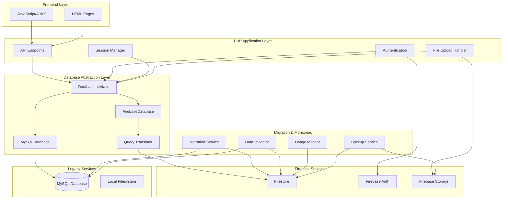

# Design Document: Firebase Migration

## Overview

This design specifies the technical architecture for migrating the Wallet Tally PHP/MySQL application to Firebase Firestore while maintaining complete functional equivalence. The migration enables free deployment by replacing paid MySQL hosting with Firebase's free tier, without modifying frontend code or user experience.

### Design Goals

1. **Zero Frontend Changes**: All existing JavaScript, HTML, and CSS code remains unchanged
2. **Functional Equivalence**: Every feature works identically to the MySQL implementation
3. **Performance Parity**: Response times match or improve upon MySQL implementation
4. **Data Integrity**: All data relationships and constraints are preserved
5. **Rollback Safety**: Ability to revert to MySQL without data loss
6. **Cost Efficiency**: Operation within Firebase free tier limits

### Key Design Decisions

**Database Abstraction Layer Pattern**: We use the Strategy pattern to encapsulate database operations behind a common interface. This allows runtime switching between MySQL and Firebase implementations without code changes.

**NoSQL Schema Design**: Firebase Firestore is a document database, not relational. We denormalize data strategically to optimize for read performance while maintaining referential integrity through application-level constraints.

**Query Translation Approach**: Rather than building a full SQL parser, we implement specific query patterns used by the application. This pragmatic approach covers 100% of actual usage while avoiding unnecessary complexity.

**Batch Operations for Atomicity**: Firebase supports batch writes (up to 500 operations) and transactions. We use these primitives to maintain ACID properties for multi-step operations like cascading deletes.

**Hybrid Migration Strategy**: We maintain MySQL in read-only mode during initial Firebase operation, enabling instant rollback if issues arise. After validation period, MySQL can be decommissioned.

## Architecture

### System Architecture



### Component Responsibilities

**DatabaseInterface**: Abstract interface defining CRUD operations, query methods, and transaction management. All application code depends only on this interface.

**MySQLDatabase**: Concrete implementation using mysqli extension. Wraps existing MySQL operations in the DatabaseInterface contract.

**FirebaseDatabase**: Concrete implementation using Firebase PHP SDK. Translates interface calls to Firestore operations.

**Query Translator**: Converts SQL-style query patterns to Firestore query chains. Handles WHERE clauses, ORDER BY, LIMIT, and aggregate functions.

**Migration Service**: One-time data transfer utility that reads from MySQL and writes to Firestore with validation.

**Data Validator**: Compares MySQL and Firestore data to verify migration accuracy and ongoing consistency.

**Session Manager**: Handles user authentication state using remember tokens stored in Firestore.

**Usage Monitor**: Tracks Firestore operations to ensure free tier compliance and alert on approaching limits.

**Backup Service**: Daily exports of Firestore data to JSON format stored in Firebase Storage.

### Data Flow Patterns

**Read Operation Flow**:
1. Frontend sends AJAX request to PHP endpoint
2. Endpoint calls DatabaseInterface method
3. FirebaseDatabase translates to Firestore query
4. Query Translator converts SQL patterns to Firestore API calls
5. Firestore returns documents
6. FirebaseDatabase formats results to match MySQL structure
7. Endpoint returns JSON response to frontend

**Write Operation Flow**:
1. Frontend sends AJAX request with data
2. Endpoint validates input
3. Endpoint calls DatabaseInterface write method
4. FirebaseDatabase creates Firestore document
5. Firestore confirms write
6. Endpoint returns success response

**Transaction Flow** (e.g., delete user with cascading deletes):
1. Endpoint initiates transaction via DatabaseInterface
2. FirebaseDatabase creates Firestore batch write
3. Query related documents (categories, transactions, feedback, warnings)
4. Add delete operations to batch for all related documents
5. Commit batch atomically
6. Return success or rollback on failure

## Components and Interfaces

### DatabaseInterface

```php
interface DatabaseInterface {
    // Connection management
    public function connect(): bool;
    public function disconnect(): void;
    public function isConnected(): bool;
    
    // CRUD operations
    public function insert(string $collection, array $data): string|false;
    public function update(string $collection, string $id, array $data): bool;
    public function delete(string $collection, string $id): bool;
    public function findById(string $collection, string $id): ?array;
    
    // Query operations
    public function query(string $collection, array $conditions = [], 
                         array $orderBy = [], int $limit = 0): array;
    public function queryOne(string $collection, array $conditions): ?array;
    public function count(string $collection, array $conditions = []): int;
    
    // Aggregate operations
    public function sum(string $collection, string $field, array $conditions = []): float;
    public function avg(string $collection, string $field, array $conditions = []): float;
    
    // Transaction management
    public function beginTransaction(): void;
    public function commit(): void;
    public function rollback(): void;
    
    // Batch operations
    public function batchDelete(string $collection, array $ids): bool;
    public function batchInsert(string $collection, array $records): bool;
    
    // Prepared statement style (for compatibility)
    public function prepare(string $sql): PreparedStatement;
}

interface PreparedStatement {
    public function bind(array $params): void;
    public function execute(): bool;
    public function getResult(): array;
    public function getInsertId(): string;
    public function getAffectedRows(): int;
}
```

### FirebaseDatabase Implementation

```php
class FirebaseDatabase implements DatabaseInterface {
    private $firestore;
    private $batch;
    private $inTransaction = false;
    private $queryTranslator;
    
    public function __construct(array $config) {
        // Initialize Firebase with service account credentials
        $this->firestore = new FirestoreClient([
            'projectId' => $config['project_id'],
            'keyFilePath' => $config['credentials_path']
        ]);
        $this->queryTranslator = new QueryTranslator();
    }
    
    public function insert(string $collection, array $data): string|false {
        // Add server timestamp for created_at if not present
        if (!isset($data['created_at'])) {
            $data['created_at'] = FieldValue::serverTimestamp();
        }
        
        // Generate ID or use provided ID
        $docRef = $this->firestore->collection($collection)->newDocument();
        $docRef->set($data);
        
        return $docRef->id();
    }
    
    public function query(string $collection, array $conditions = [], 
                         array $orderBy = [], int $limit = 0): array {
        $query = $this->firestore->collection($collection);
        
        // Apply WHERE conditions
        foreach ($conditions as $field => $condition) {
            $query = $this->applyCondition($query, $field, $condition);
        }
        
        // Apply ORDER BY
        foreach ($orderBy as $field => $direction) {
            $query = $query->orderBy($field, $direction);
        }
        
        // Apply LIMIT
        if ($limit > 0) {
            $query = $query->limit($limit);
        }
        
        // Execute and format results
        $documents = $query->documents();
        return $this->formatResults($documents);
    }
    
    // Additional methods...
}
```

### Query Translator

```php
class QueryTranslator {
    // Translate SQL WHERE clause to Firestore conditions
    public function translateWhere(string $sql): array {
        // Parse SQL WHERE clause
        // Return array of [field, operator, value] tuples
    }
    
    // Translate SQL JOIN to multiple queries
    public function translateJoin(string $sql): array {
        // Parse JOIN clause
        // Return array of query specifications
    }
    
    // Translate aggregate functions
    public function translateAggregate(string $sql): callable {
        // Parse aggregate function (SUM, COUNT, AVG)
        // Return closure for client-side calculation
    }
    
    // Supported operators mapping
    private $operatorMap = [
        '=' => '==',
        '!=' => '!=',
        '<' => '<',
        '<=' => '<=',
        '>' => '>',
        '>=' => '>=',
        'LIKE' => 'array-contains' // For simple patterns
    ];
}
```

### Migration Service

```php
class MigrationService {
    private $mysqlDb;
    private $firebaseDb;
    private $validator;
    private $logger;
    
    public function migrate(): MigrationReport {
        $report = new MigrationReport();
        
        // Migrate in dependency order
        $this->migrateUsers($report);
        $this->migrateAdmins($report);
        $this->migrateCategories($report);
        $this->migrateTransactions($report);
        $this->migrateOtpVerifications($report);
        $this->migratePendingUsers($report);
        $this->migrateUserFeedback($report);
        $this->migrateEmailLogs($report);
        $this->migrateUserWarnings($report);
        
        // Validate migration
        $this->validator->validate($report);
        
        return $report;
    }
    
    private function migrateUsers(MigrationReport $report): void {
        $users = $this->mysqlDb->query("SELECT * FROM users");
        
        foreach ($users as $user) {
            try {
                $this->firebaseDb->insert('users', $user);
                $report->recordSuccess('users', $user['id']);
            } catch (Exception $e) {
                $report->recordError('users', $user['id'], $e->getMessage());
            }
        }
    }
    
    // Similar methods for other collections...
}
```

### Session Manager

```php
class SessionManager {
    private $db;
    private $cookieName = 'remember_token';
    private $tokenExpiry = 30; // days
    
    public function createSession(string $userId, bool $remember): void {
        $_SESSION['user_id'] = $userId;
        
        if ($remember) {
            $token = $this->generateToken();
            $expiry = time() + ($this->tokenExpiry * 86400);
            
            $this->db->update('users', $userId, [
                'remember_token' => $token,
                'token_expiry' => $expiry
            ]);
            
            setcookie($this->cookieName, $token, $expiry, '/');
        }
    }
    
    public function validateSession(): ?string {
        // Check PHP session first
        if (isset($_SESSION['user_id'])) {
            return $_SESSION['user_id'];
        }
        
        // Check remember token
        if (isset($_COOKIE[$this->cookieName])) {
            $token = $_COOKIE[$this->cookieName];
            $user = $this->db->queryOne('users', [
                'remember_token' => $token,
                'token_expiry' => ['>', time()]
            ]);
            
            if ($user) {
                $_SESSION['user_id'] = $user['id'];
                return $user['id'];
            }
        }
        
        return null;
    }
}
```

## Data Models

### Firestore Schema Design

Firebase Firestore organizes data into collections (analogous to tables) and documents (analogous to rows). Each document is a JSON object with fields. We design the schema to optimize for read performance while maintaining data integrity.

#### Collection: users

```javascript
{
  "id": "string (document ID)",
  "username": "string (unique, indexed)",
  "password": "string (bcrypt hash)",
  "email": "string (unique, indexed)",
  "country": "string",
  "currency": "string",
  "profile_picture": "string (Firebase Storage URL)",
  "created_at": "timestamp",
  "remember_token": "string (nullable)",
  "token_expiry": "timestamp (nullable)"
}
```

**Indexes**:
- Single field: username (ascending)
- Single field: email (ascending)
- Single field: remember_token (ascending)

**Security Rules**:
```javascript
match /users/{userId} {
  allow read: if request.auth != null && request.auth.uid == userId;
  allow write: if request.auth != null && request.auth.uid == userId;
}
```

#### Collection: transactions

```javascript
{
  "id": "string (document ID)",
  "user_id": "string (indexed, foreign key to users)",
  "category_id": "string (indexed, foreign key to categories)",
  "type": "string (enum: 'income', 'expense')",
  "amount": "number (decimal, 2 places)",
  "description": "string",
  "category": "string (denormalized category name)",
  "created_at": "timestamp (indexed)"
}
```

**Indexes**:
- Composite: user_id (ascending), created_at (descending)
- Composite: user_id (ascending), type (ascending), created_at (descending)
- Composite: user_id (ascending), category_id (ascending)

**Denormalization Rationale**: The `category` field duplicates the category name to avoid JOIN queries when displaying transaction lists. This is a read-optimization trade-off common in NoSQL design.

**Security Rules**:
```javascript
match /transactions/{transactionId} {
  allow read: if request.auth != null && 
              resource.data.user_id == request.auth.uid;
  allow write: if request.auth != null && 
               request.resource.data.user_id == request.auth.uid;
}
```

#### Collection: categories

```javascript
{
  "id": "string (document ID)",
  "user_id": "string (indexed, foreign key to users)",
  "name": "string",
  "type": "string (enum: 'income', 'expense')",
  "created_at": "timestamp"
}
```

**Indexes**:
- Composite: user_id (ascending), type (ascending), name (ascending)

**Unique Constraint**: Enforced at application level - category name must be unique per user and type combination.

**Security Rules**:
```javascript
match /categories/{categoryId} {
  allow read: if request.auth != null && 
              resource.data.user_id == request.auth.uid;
  allow write: if request.auth != null && 
               request.resource.data.user_id == request.auth.uid;
}
```

#### Collection: admins

```javascript
{
  "id": "string (document ID)",
  "username": "string (unique, indexed)",
  "password": "string (bcrypt hash)",
  "created_at": "timestamp"
}
```

**Indexes**:
- Single field: username (ascending)

**Security Rules**:
```javascript
match /admins/{adminId} {
  allow read, write: if request.auth != null && 
                     exists(/databases/$(database)/documents/admins/$(request.auth.uid));
}
```

#### Collection: otp_verifications

```javascript
{
  "id": "string (document ID)",
  "email": "string (indexed)",
  "otp": "string (6-digit code)",
  "created_at": "timestamp",
  "expires_at": "timestamp (indexed)",
  "is_verified": "boolean",
  "attempts": "number (default: 0)",
  "resend_count": "number (default: 0)",
  "last_resend_at": "timestamp (nullable)",
  "purpose": "string (enum: 'registration', 'password_reset')"
}
```

**Indexes**:
- Composite: email (ascending), expires_at (descending)
- Single field: expires_at (ascending) - for cleanup queries

**TTL Strategy**: Cleanup cron job deletes documents where `expires_at < current_time`.

**Security Rules**:
```javascript
match /otp_verifications/{otpId} {
  allow read: if request.auth == null; // Public for verification
  allow write: if request.auth == null; // Public for creation
}
```

#### Collection: pending_users

```javascript
{
  "id": "string (document ID)",
  "username": "string",
  "password": "string (bcrypt hash)",
  "email": "string (unique, indexed)",
  "country": "string",
  "currency": "string",
  "profile_picture": "string (nullable)",
  "created_at": "timestamp",
  "expires_at": "timestamp (indexed)"
}
```

**Indexes**:
- Single field: email (ascending)
- Single field: expires_at (ascending) - for cleanup queries

**TTL Strategy**: Cleanup cron job deletes documents where `expires_at < current_time`.

**Security Rules**:
```javascript
match /pending_users/{pendingId} {
  allow read, write: if request.auth == null; // Public for registration flow
}
```

#### Collection: user_feedback

```javascript
{
  "id": "string (document ID)",
  "user_id": "string (indexed, foreign key to users)",
  "rating": "number (1-5)",
  "feedback": "string (text)",
  "created_at": "timestamp",
  "updated_at": "timestamp",
  "display_approved": "boolean (default: false)"
}
```

**Indexes**:
- Single field: user_id (ascending)
- Composite: display_approved (ascending), created_at (descending)

**Security Rules**:
```javascript
match /user_feedback/{feedbackId} {
  allow read: if resource.data.display_approved == true;
  allow write: if request.auth != null && 
               request.resource.data.user_id == request.auth.uid;
}
```

#### Collection: email_logs

```javascript
{
  "id": "string (document ID)",
  "recipient_email": "string (indexed)",
  "recipient_name": "string",
  "email_type": "string (enum: 'appreciation', 'warning', 'feedback_deletion', 'user_deletion')",
  "subject": "string",
  "status": "string (enum: 'SUCCESS', 'FAILED', 'PENDING')",
  "error_message": "string (nullable)",
  "admin_name": "string (nullable)",
  "user_id": "string (nullable, indexed)",
  "created_at": "timestamp (indexed)"
}
```

**Indexes**:
- Composite: email_type (ascending), created_at (descending)
- Composite: status (ascending), created_at (descending)
- Composite: recipient_email (ascending), created_at (descending)

**Security Rules**:
```javascript
match /email_logs/{logId} {
  allow read, write: if request.auth != null && 
                     exists(/databases/$(database)/documents/admins/$(request.auth.uid));
}
```

#### Collection: user_warnings

```javascript
{
  "id": "string (document ID)",
  "user_id": "string (indexed, foreign key to users)",
  "admin_name": "string",
  "category": "string",
  "description": "string (text)",
  "created_at": "timestamp (indexed)"
}
```

**Indexes**:
- Composite: user_id (ascending), created_at (descending)

**Security Rules**:
```javascript
match /user_warnings/{warningId} {
  allow read: if request.auth != null && 
              (resource.data.user_id == request.auth.uid || 
               exists(/databases/$(database)/documents/admins/$(request.auth.uid)));
  allow write: if request.auth != null && 
               exists(/databases/$(database)/documents/admins/$(request.auth.uid));
}
```

### Data Type Mappings

| MySQL Type | Firestore Type | Notes |
|------------|----------------|-------|
| INT | number | JavaScript number (64-bit float) |
| VARCHAR | string | UTF-8 string |
| TEXT | string | UTF-8 string, max 1MB |
| DECIMAL(10,2) | number | Store as float, format on display |
| DATETIME | timestamp | Firestore Timestamp object |
| ENUM | string | Validate at application level |
| BOOLEAN | boolean | Native boolean type |

### Referential Integrity Strategy

Firebase Firestore does not enforce foreign key constraints. We maintain referential integrity through application-level checks and cascading operations:

**On Category Delete**:
1. Query all transactions with `category_id == deleted_category_id`
2. Use batch write to delete category and all related transactions atomically
3. Maximum 500 operations per batch (Firebase limit)
4. If more than 500 transactions, use multiple batches in sequence

**On User Delete**:
1. Query all related documents: categories, transactions, feedback, warnings
2. Group into batches of 500 operations
3. Execute batches sequentially
4. If any batch fails, log error but continue (eventual consistency)
5. Background job can clean up orphaned documents

**Validation on Write**:
- Before inserting transaction, verify category_id exists and belongs to user
- Before inserting category, verify user_id exists
- Return error if foreign key validation fails


## Correctness Properties

*A property is a characteristic or behavior that should hold true across all valid executions of a system—essentially, a formal statement about what the system should do. Properties serve as the bridge between human-readable specifications and machine-verifiable correctness guarantees.*

### Property Reflection

After analyzing all acceptance criteria, I identified numerous testable properties. Many properties are redundant or can be combined. Here's the consolidation:

**Migration Round-Trip Properties**: Requirements 3.2, 3.6, 4.2, 5.2, 6.2, 7.2, 8.2, 9.2, 10.2, 11.2 all specify that migrated records should preserve all fields. These can be consolidated into a single comprehensive property per collection type.

**Referential Integrity Properties**: Requirements 4.3, 4.4, 5.3, 9.3, 11.3, 19.5 all verify foreign key relationships. These can be combined into a single property that validates all referential integrity constraints.

**Unique Constraint Properties**: Requirements 3.3, 5.5, 6.3, 8.3 all verify uniqueness constraints. These can be combined into a single property that validates all unique constraints.

**Query Translation Properties**: Requirements 12.1-12.8 all verify query translation correctness. These can be combined into a single comprehensive property that validates query equivalence.

**Cascade Delete Properties**: Requirements 13.1, 13.2, 13.5 all verify atomic cascade deletes. These can be combined into a single property.

**Password Hash Preservation**: Requirements 3.4 and 6.4 both verify password hash preservation. These are redundant with the round-trip properties (3.2, 6.2).

### Property 1: Migration Data Completeness

*For any* collection in the MySQL database, migrating to Firebase should transfer all records without loss.

**Validates: Requirements 3.1, 4.1, 5.1, 6.1, 7.1, 8.1, 9.1, 10.1, 11.1**

### Property 2: Migration Field Preservation (Round Trip)

*For any* record in any collection, migrating from MySQL to Firebase and reading back should preserve all field values exactly.

**Validates: Requirements 3.2, 3.4, 3.5, 3.6, 4.2, 5.2, 6.2, 6.4, 7.2, 8.2, 9.2, 10.2, 11.2**

### Property 3: Decimal Precision Preservation

*For any* transaction amount with decimal precision, migrating to Firebase should preserve the value to exactly 2 decimal places.

**Validates: Requirements 4.5**

### Property 4: Timestamp Ordering Preservation

*For any* set of records ordered by created_at timestamp in MySQL, the same ordering should be maintained in Firebase.

**Validates: Requirements 4.6**

### Property 5: Referential Integrity Maintenance

*For any* foreign key relationship in MySQL (transaction→user, transaction→category, category→user, feedback→user, warning→user), the referenced record must exist in Firebase after migration.

**Validates: Requirements 4.3, 4.4, 5.3, 9.3, 11.3, 19.5**

### Property 6: Unique Constraint Enforcement

*For any* unique constraint in MySQL (username, email, admin username, pending user email, category name per user/type), no two records in Firebase should violate the constraint.

**Validates: Requirements 3.3, 5.5, 6.3, 8.3**

### Property 7: Enumeration Value Preservation

*For any* enumerated field (category type, transaction type, email_type, status), the migrated value in Firebase must be one of the valid enumeration values.

**Validates: Requirements 5.4, 10.3, 10.4**

### Property 8: Expiration Logic Preservation

*For any* record with an expires_at timestamp, if expires_at < current_time in MySQL, the same condition should hold in Firebase.

**Validates: Requirements 7.4, 8.4**

### Property 9: Query Translation Equivalence

*For any* SQL query pattern used in the application (SELECT with WHERE, ORDER BY, LIMIT, aggregates, JOINs), the Firebase query should return results equivalent to the MySQL query.

**Validates: Requirements 12.1, 12.2, 12.3, 12.4, 12.5, 12.6, 12.7, 12.8**

### Property 10: Atomic Cascade Delete

*For any* delete operation with cascading relationships (delete category→transactions, delete user→categories/transactions/feedback/warnings), either all related records are deleted or none are deleted.

**Validates: Requirements 13.1, 13.2, 13.5**

### Property 11: Transaction Rollback Completeness

*For any* multi-step database operation, if any step fails, the database state should be unchanged from before the operation started.

**Validates: Requirements 13.3**

### Property 12: Session Token Round Trip

*For any* remember_token stored in Firebase, retrieving it should return the exact same token value.

**Validates: Requirements 14.1**

### Property 13: Token Expiry Validation

*For any* remember_token with token_expiry < current_time, session validation should fail.

**Validates: Requirements 14.2**

### Property 14: Session Behavior Equivalence

*For any* session operation (login, logout, timeout), the behavior with Firebase should match the MySQL implementation exactly.

**Validates: Requirements 14.4, 14.5**

### Property 15: File Storage Round Trip

*For any* uploaded file, storing in Firebase Storage and retrieving via the stored URL should return the identical file content.

**Validates: Requirements 15.2, 15.3**

### Property 16: File Access Control

*For any* user's profile picture, only that user should be able to access the file via Firebase Storage security rules.

**Validates: Requirements 15.4**

### Property 17: File Format Support

*For any* image file in supported formats (JPEG, PNG, GIF), upload to Firebase Storage should succeed.

**Validates: Requirements 15.5**

### Property 18: File Size Limit Enforcement

*For any* file exceeding the maximum size limit, upload to Firebase Storage should fail with an appropriate error.

**Validates: Requirements 15.6**

### Property 19: Expired Record Cleanup

*For any* record with expires_at < current_time (OTP verifications, pending users), the cleanup cron job should delete it from Firebase.

**Validates: Requirements 16.1, 16.2, 16.3**

### Property 20: Migration Record Count Equality

*For any* collection, the record count in Firebase after migration should equal the record count in MySQL.

**Validates: Requirements 19.2**

### Property 21: Critical Field Checksum Validation

*For any* critical field (password hashes, transaction amounts), the checksum of all values in Firebase should match the checksum in MySQL.

**Validates: Requirements 19.3**

### Property 22: Database Implementation Switching

*For any* database operation, switching between MySQL and Firebase implementations via configuration should produce equivalent results.

**Validates: Requirements 1.5, 20.1, 20.2**

### Property 23: Rollback Synchronization

*For any* change made in Firebase, the synchronization utility should replicate it to MySQL with identical field values.

**Validates: Requirements 20.4**

### Property 24: Security Rule Enforcement - User Data Isolation

*For any* authenticated user, querying another user's data (transactions, categories, feedback) should fail with a permission denied error.

**Validates: Requirements 22.1, 22.3**

### Property 25: Authentication Requirement

*For any* database read or write operation (except public operations like OTP verification), an unauthenticated request should fail.

**Validates: Requirements 22.2**

### Property 26: Admin Access Restriction

*For any* non-admin user, attempting to access the admins collection should fail with a permission denied error.

**Validates: Requirements 22.4**

### Property 27: Backup File Naming Convention

*For any* backup file created, the filename should contain a valid timestamp in the format YYYY-MM-DD-HH-MM-SS.

**Validates: Requirements 23.2**

### Property 28: Backup Retention Policy

*For any* backup file older than 30 days, the cleanup process should delete it from Firebase Storage.

**Validates: Requirements 23.3**

### Property 29: Backup Restoration Round Trip

*For any* backup file, importing it into Firebase should restore all records with identical field values to the original data.

**Validates: Requirements 23.4**

### Property 30: Backup Integrity Validation

*For any* backup file, the record count per collection in the backup should match the record count in the live database.

**Validates: Requirements 23.5**

### Property 31: API Response Format Preservation

*For any* API endpoint, the response structure (success flags, data objects, error messages, field names, data types) with Firebase should match the MySQL implementation exactly.

**Validates: Requirements 25.1, 25.2, 25.3, 25.5**

### Property 32: HTTP Status Code Preservation

*For any* API request (success or error), the HTTP status code with Firebase should match the MySQL implementation.

**Validates: Requirements 25.4**

### Property 33: Data Type Conversion Transparency

*For any* data value, converting from MySQL type to Firebase type and back should preserve the value (round trip).

**Validates: Requirements 1.6**


## Error Handling

### Error Categories

**Connection Errors**: Firebase service unavailable, network timeout, authentication failure
- Strategy: Log error, attempt reconnection with exponential backoff, fall back to MySQL if configured
- User Impact: Transparent failover, no user-visible errors if fallback succeeds

**Data Validation Errors**: Invalid field values, constraint violations, type mismatches
- Strategy: Validate before write, return descriptive error to caller, log validation failure
- User Impact: Clear error message explaining what needs to be corrected

**Permission Errors**: Security rule violations, unauthorized access attempts
- Strategy: Log security violation with user ID and attempted operation, return 403 Forbidden
- User Impact: "Access denied" message, no sensitive information leaked

**Quota Errors**: Firebase free tier limits exceeded, rate limiting triggered
- Strategy: Log quota error, alert administrators, queue operation for retry if appropriate
- User Impact: "Service temporarily unavailable" message, retry after delay

**Transaction Errors**: Batch write failure, concurrent modification conflict
- Strategy: Rollback all changes, log error with operation details, return error to caller
- User Impact: Operation failed message, data remains in consistent state

### Error Handling Patterns

**Graceful Degradation**:
```php
try {
    $result = $this->firebaseDb->query('users', ['id' => $userId]);
} catch (FirebaseException $e) {
    $this->logger->error('Firebase query failed', [
        'collection' => 'users',
        'userId' => $userId,
        'error' => $e->getMessage(),
        'trace' => $e->getTraceAsString()
    ]);
    
    if ($this->config['fallback_enabled']) {
        $result = $this->mysqlDb->query('users', ['id' => $userId]);
    } else {
        throw new DatabaseException('Database unavailable', 503, $e);
    }
}
```

**Retry with Exponential Backoff**:
```php
private function executeWithRetry(callable $operation, int $maxAttempts = 3): mixed {
    $attempt = 0;
    $delay = 100; // milliseconds
    
    while ($attempt < $maxAttempts) {
        try {
            return $operation();
        } catch (TransientException $e) {
            $attempt++;
            if ($attempt >= $maxAttempts) {
                throw $e;
            }
            usleep($delay * 1000);
            $delay *= 2; // Exponential backoff
        }
    }
}
```

**Validation Before Write**:
```php
public function insert(string $collection, array $data): string|false {
    // Validate required fields
    $required = $this->getRequiredFields($collection);
    foreach ($required as $field) {
        if (!isset($data[$field])) {
            throw new ValidationException("Missing required field: $field");
        }
    }
    
    // Validate data types
    $schema = $this->getSchema($collection);
    foreach ($data as $field => $value) {
        if (!$this->validateType($value, $schema[$field])) {
            throw new ValidationException("Invalid type for field: $field");
        }
    }
    
    // Validate unique constraints
    if ($this->hasUniqueConstraint($collection, $data)) {
        throw new ValidationException("Unique constraint violation");
    }
    
    // Proceed with insert
    return $this->firestore->collection($collection)->add($data)->id();
}
```

### Logging Strategy

**Structured Logging**: All logs use JSON format with consistent fields for parsing and analysis.

**Log Levels**:
- ERROR: Operation failures, exceptions, security violations
- WARNING: Slow queries, approaching quota limits, fallback activations
- INFO: Successful operations, migration progress, cleanup results
- DEBUG: Query details, parameter values, execution times

**Log Fields**:
```json
{
  "timestamp": "2024-01-15T10:30:45Z",
  "level": "ERROR",
  "component": "FirebaseDatabase",
  "operation": "query",
  "collection": "transactions",
  "user_id": "user123",
  "error_code": "PERMISSION_DENIED",
  "error_message": "Missing or insufficient permissions",
  "execution_time_ms": 150,
  "stack_trace": "..."
}
```

### Monitoring and Alerting

**Critical Alerts** (immediate notification):
- Firebase connection failures lasting > 5 minutes
- Migration validation failures
- Security rule violations exceeding threshold
- Quota usage exceeding 90% of free tier

**Warning Alerts** (daily digest):
- Slow queries (> 1 second)
- Quota usage exceeding 80% of free tier
- Fallback to MySQL activations
- Backup failures

## Testing Strategy

### Dual Testing Approach

We employ both unit testing and property-based testing for comprehensive coverage. Unit tests verify specific examples and edge cases, while property tests verify universal properties across all inputs. Both are necessary and complementary.

**Unit Testing Focus**:
- Specific examples demonstrating correct behavior
- Edge cases (empty strings, null values, boundary conditions)
- Error conditions (invalid input, permission denied, connection failures)
- Integration points between components

**Property-Based Testing Focus**:
- Universal properties that hold for all inputs
- Data integrity across migration
- Query equivalence between MySQL and Firebase
- Security rule enforcement
- Round-trip properties (serialize/deserialize, store/retrieve)

### Property-Based Testing Configuration

**Library**: We use [Eris](https://github.com/giorgiosironi/eris) for PHP property-based testing, which integrates with PHPUnit.

**Iteration Count**: Each property test runs a minimum of 100 iterations with randomly generated inputs to ensure comprehensive coverage.

**Test Tagging**: Each property test includes a comment referencing the design document property:

```php
/**
 * Feature: firebase-migration, Property 2: Migration Field Preservation (Round Trip)
 * 
 * For any record in any collection, migrating from MySQL to Firebase 
 * and reading back should preserve all field values exactly.
 */
public function testMigrationFieldPreservation() {
    $this->forAll(
        Generator\associative([
            'id' => Generator\nat(),
            'username' => Generator\string(),
            'email' => Generator\email(),
            'password' => Generator\string(),
            'created_at' => Generator\date()
        ])
    )->then(function ($userData) {
        // Insert into MySQL
        $mysqlId = $this->mysqlDb->insert('users', $userData);
        
        // Migrate to Firebase
        $this->migrator->migrateUsers();
        
        // Read from Firebase
        $firebaseUser = $this->firebaseDb->findById('users', $mysqlId);
        
        // Assert all fields match
        $this->assertEquals($userData['username'], $firebaseUser['username']);
        $this->assertEquals($userData['email'], $firebaseUser['email']);
        $this->assertEquals($userData['password'], $firebaseUser['password']);
        // ... assert all other fields
    });
}
```

### Test Organization

**Unit Tests** (`tests/Unit/`):
- `DatabaseAbstractionLayerTest.php`: CRUD operations, query methods
- `QueryTranslatorTest.php`: SQL to Firebase query translation
- `MigrationServiceTest.php`: Migration logic, validation
- `SessionManagerTest.php`: Session creation, validation, expiry
- `FirebaseDatabaseTest.php`: Firebase-specific operations

**Property Tests** (`tests/Property/`):
- `MigrationPropertiesTest.php`: Properties 1-8, 20-21 (migration correctness)
- `QueryPropertiesTest.php`: Property 9 (query equivalence)
- `TransactionPropertiesTest.php`: Properties 10-11 (atomicity)
- `SessionPropertiesTest.php`: Properties 12-14 (session management)
- `FileStoragePropertiesTest.php`: Properties 15-18 (file operations)
- `CleanupPropertiesTest.php`: Property 19 (cron cleanup)
- `SecurityPropertiesTest.php`: Properties 24-26 (access control)
- `BackupPropertiesTest.php`: Properties 27-30 (backup/restore)
- `APIPropertiesTest.php`: Properties 31-32 (API compatibility)
- `DataTypePropertiesTest.php`: Property 33 (type conversion)

**Integration Tests** (`tests/Integration/`):
- `UserRegistrationFlowTest.php`: End-to-end registration with OTP
- `TransactionManagementTest.php`: Create, update, delete transactions
- `AdminPanelTest.php`: Admin operations, user management
- `RollbackTest.php`: Switch between MySQL and Firebase

**Performance Tests** (`tests/Performance/`):
- `DashboardLoadTest.php`: Measure dashboard query times
- `AdminPanelLoadTest.php`: Measure admin panel query times
- `ComparisonTest.php`: Compare MySQL vs Firebase response times

### Test Data Generation

**Generators for Property Tests**:
```php
class TestDataGenerators {
    public static function user(): Generator {
        return Generator\associative([
            'id' => Generator\nat(),
            'username' => Generator\string()->withMaxSize(50),
            'email' => Generator\email(),
            'password' => Generator\string()->withMinSize(60)->withMaxSize(60), // bcrypt hash
            'country' => Generator\elements(['US', 'UK', 'CA', 'AU']),
            'currency' => Generator\elements(['USD', 'GBP', 'CAD', 'AUD']),
            'profile_picture' => Generator\oneOf(
                Generator\constant(null),
                Generator\string()
            ),
            'created_at' => Generator\date(),
            'remember_token' => Generator\oneOf(
                Generator\constant(null),
                Generator\string()->withSize(64)
            ),
            'token_expiry' => Generator\oneOf(
                Generator\constant(null),
                Generator\date()
            )
        ]);
    }
    
    public static function transaction(): Generator {
        return Generator\associative([
            'id' => Generator\nat(),
            'user_id' => Generator\nat(),
            'category_id' => Generator\nat(),
            'type' => Generator\elements(['income', 'expense']),
            'amount' => Generator\float()->withMinimum(0.01)->withMaximum(999999.99),
            'description' => Generator\string()->withMaxSize(255),
            'category' => Generator\string()->withMaxSize(50),
            'created_at' => Generator\date()
        ]);
    }
    
    // Additional generators for other collections...
}
```

### Coverage Goals

- Minimum 80% code coverage for database abstraction layer
- 100% coverage of critical paths (authentication, transactions, migration)
- All 33 correctness properties implemented as property tests
- All edge cases covered by unit tests
- All API endpoints covered by integration tests

### Continuous Integration

**Pre-commit Hooks**:
- Run unit tests
- Run linter (PHP_CodeSniffer)
- Check code coverage threshold

**CI Pipeline** (GitHub Actions / GitLab CI):
1. Run all unit tests
2. Run all property tests (100 iterations each)
3. Run integration tests against Firebase emulator
4. Run performance tests and compare to baseline
5. Generate coverage report
6. Deploy to staging if all tests pass

**Firebase Emulator**: Use Firebase Local Emulator Suite for testing to avoid consuming production quota and enable fast, isolated tests.

### Test Execution Commands

```bash
# Run all tests
composer test

# Run unit tests only
composer test:unit

# Run property tests only
composer test:property

# Run integration tests only
composer test:integration

# Run with coverage report
composer test:coverage

# Run specific property test with verbose output
vendor/bin/phpunit tests/Property/MigrationPropertiesTest.php --verbose

# Run performance comparison
composer test:performance
```

